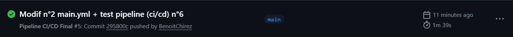

# TP Final DevOps - Startup Lacets Connectés

Ce projet vise à mettre en place une infrastructure complète, automatisée et scalable pour le déploiement d'une API REST Node.js.

## 📁 Structure du Projet
```text
.
├── README.md
├── TP Final.pdf
├── app
│   ├── Dockerfile
│   ├── README.md
│   ├── assets
│   │   └── postman
│   │       ├── postman-global-env-variables.png
│   │       └── postman-jobs-env-variables.png
│   ├── config
│   │   └── default.js
│   ├── package-lock.json
│   ├── package.json
│   ├── postman
│   │   └── User.postman_collection.json
│   ├── sql
│   │   └── init-db.sql
│   └── src
│       ├── app.js
│       ├── controllers
│       │   └── api.controller.js
│       ├── databases
│       │   └── mysql.db.js
│       ├── index.js
│       ├── models
│       │   └── user.model.js
│       └── routers
│           └── api.router.js
├── img
│   └── image_workflow.png
├── infrastructure
│   ├── Vagrantfile
│   ├── install_k3s.yaml
│   ├── inventory.ini
│   └── setup_infra.sh
└── k8s
    ├── api-deployment.yaml
    ├── api-hpa.yaml
    ├── mysql-db.yaml
    └── mysql-pvc.yaml

15 directories, 26 files
```

---

## Partie 1 : Préparation de l'infrastructure

L'objectif est de mettre en place une infrastructure, qui servira à déployer l’application.

### Choix techniques
- **Vagrant** : Utilisation d'une box `debian/bookworm64` configurée avec **2 Go de RAM** et **2 CPUs**.
- **Réseau** : Configuration d'une IP statique `192.168.56.10` sur un réseau privé (`private_network`) pour garantir une connectivité SSH stable.
- **Ansible** : Automatisation de l'installation de **K3s** (Kubernetes léger) de manière idempotente.

### Commandes pour déployer l'infrastructure
```bash
cd infrastructure
chmod +x setup_infra.sh
./setup_infra.sh
```
- *Vérification :* `vagrant ssh -c "sudo k3s kubectl get nodes"`
- On est sencé avoir notre node en position Ready.
---

### Descriptif des fichiers
- **Vagrantfile** : Définit les spécifications de la machine virtuelle (OS, ressources matérielles, réseau) via VirtualBox.

- **install_k3s.yaml** : Playbook Ansible automatisant le provisionnement logiciel du cluster Kubernetes sur le nœud Debian.

- **(Rappel Kubernetes)** : K3s est une distribution Kubernetes certifiée et légère. Il agit comme l'orchestrateur central chargé de piloter le cycle de vie des conteneurs.


## Partie 2 : Conteneurisation de l'application

L'objectif était de créer une image Docker la plus légère, sécurisée possible et prête pour la production.

### Choix d'optimisation (Dockerfile)
- **Image de base** : `node:20-alpine` pour réduire la taille de l'image (environ 160 Mo) et limiter la surface d'attaque.
- **Multi-stage build (logique)** : Utilisation de `npm install --production` pour exclure les dépendances de développement.
- **Gestion des processus** : L'application est lancée directement via `node server.js` (ou via le point d'entrée défini) pour une meilleure gestion des signaux système par Docker.

### Publication
L'image est hébergée sur Docker Hub et configurée pour l'architecture `amd64` (Linux) afin d'être compatible avec le cluster K3s.
- **Image** : `benoitchirez/api-lacets:v1`

### Descriptif des fichiers
- **Dockerfile** : Manifeste de construction décrivant les couches (layers) nécessaires pour encapsuler l'application Node.js.

- **(Rappel Conteneurs/Images)** :

    - **Image** : Artefact immuable contenant le code et son environnement d'exécution.

    - **Conteneur** : Instance isolée d'une image. L'intérêt majeur est la portabilité : l'application fonctionne de manière identique quel que soit l'hôte.

---


## 🚀 Partie 3 : Orchestration avec Kubernetes

Le déploiement utilise Kubernetes (K3s) pour garantir la haute disponibilité et la scalabilité de l'API.

### Architecture des Manifests (Dossier /k8s)
- **Persistance (MySQL)** :
    - Un `PersistentVolumeClaim` (PVC) de **1Go** garantit que les données de la startup ne sont pas perdues en cas de redémarrage du Pod.
    - Le déploiement MySQL utilise ce volume monté sur `/var/lib/mysql`.
- **Scalabilité (HPA)** :
    - Un `HorizontalPodAutoscaler` surveille l'utilisation CPU.
    - Le nombre de Pods de l'API varie automatiquement entre **1 et 3 réplicas** selon la charge (seuil à 50% CPU).
- **Sécurité Réseau** :
    - Le service `api-lacet` est de type `ClusterIP`. L'API est donc exposée sur le **port 80** à l'intérieur du cluster mais reste **invisible de l'extérieur**.

### Commandes de déploiement
```bash
# Application de la configuration
vagrant ssh -c "sudo kubectl apply -f /vagrant/k8s/"
```

### Vérification du statut final
Le déploiement est validé avec les deux Pods en statut `Running` :
- `api-lacet-xxx` : Opérationnel après résolution automatique des dépendances (RESTARTS: 2 au démarrage pour attendre MySQL).
- `mysql-xxx` : Opérationnel et lié au volume persistant.

```bash
# Commande de vérification
vagrant ssh -c "sudo kubectl get pods,pvc,hpa"
```
```text
NAME                             READY   STATUS    RESTARTS
api-lacet-6d54f75689-lfxx6       1/1     Running   2
mysql-54fcb9488-x7sfj            1/1     Running   0
```

### Descriptif des fichiers
- **mysql-pvc.yaml** : Définit une ressource de stockage persistante de 1Go pour garantir l'intégrité des données MySQL en cas de recréation du Pod.

- **mysql-db.yaml** : Déploiement de la base de données MySQL 5.7 associé à un service ClusterIP pour l'exposition interne.

- **api-deployment.yaml** : Déploiement de l'API REST incluant les limites de ressources (CPU/RAM) et un service de type ClusterIP pour restreindre l'accès à l'intérieur du cluster.

- **api-hpa.yaml** : Configuration de l'auto-scaling horizontal permettant de faire varier dynamiquement le nombre de réplicas de 1 à 3 selon la charge CPU.

- **(Rappel Kubernetes)** :

    - **Pod** : Plus petite unité d'exécution contenant un ou plusieurs conteneurs.

    - **Service** : Abstraction réseau fournissant une adresse IP stable pour joindre un groupe de Pods.

    - **HPA** : Mécanisme d'ajustement automatique de la capacité (scaling) basé sur l'utilisation des ressources.

---


## 🔄 Partie 4 : Mise en place du CI/CD (Automatisation)

L'objectif de cette étape est d'automatiser le cycle de déploiement. Dès qu'un changement est poussé sur la branche `main`, l'infrastructure est mise à jour, l'image est reconstruite et déployée sans intervention manuelle.

### 1. Configuration du Runner Self-Hosted
Pour permettre à GitHub de piloter une infrastructure locale (Vagrant/K3s), un **runner self-hosted** a été configuré.
- **Installation** : Le runner a été installé directement sur la machine hôte (ou la VM) via l'interface GitHub (*Settings > Actions > Runners*).
- **Dossier `../TP_DevOps_Runner/actions-runner/`** : Ce dossier local contient les scripts binaires (`run.sh`, `config.sh`) permettant de maintenir la connexion persistante avec GitHub Actions. (la position de ce dossier importe peux tant qu'il ne se trouve pas dans le github (pour éviter de commit à chaques fois une grande quantité de fichier))

### 2. Le Workflow : `.github/workflows/main.yml`
Le cœur de l'automatisation se trouve dans le fichier `.github/workflows/main.yml`. Ce fichier définit trois étapes clés exécutées sur le runner self-hosted :

1.  **Configuration de l'infra** : Exécution du script `setup_infra.sh` pour s'assurer que K3s est opérationnel.
2.  **Build de l'image** : Construction de l'image Docker à partir du dossier `/app` avec le tag `latest`.
3.  **Déploiement** : Application des manifests Kubernetes du dossier `/k8s` et redémarrage (rollout) du déploiement `api-lacet` pour forcer la mise à jour des Pods.

### 3. Manipulations sur GitHub (Secrets & Interface)
Pour que le pipeline fonctionne en toute sécurité, les manipulations suivantes ont été effectuées sur l'interface GitHub :
- **GitHub Secrets** : Stockage sécurisé des identifiants Docker Hub (`DOCKER_USERNAME` et `DOCKER_PASSWORD`) pour permettre le push de l'image sans les écrire en clair dans le code.
- **Monitoring** : Suivi en temps réel de l'exécution via l'onglet **Actions** dans github. Chaque étape (Infra, Build, Deploy) est validée par un indicateur vert, confirmant le succès du processus.

On doit normalement voir sur github ceci : 


### Descriptif des fichiers
- **.github/workflows/main.yml** : Workflow GitHub Actions orchestrant les étapes de build, de push d'image et de mise à jour du déploiement.

- **(Rappel)** : Le Runner Self-hosted est un agent d'exécution installé localement. Il permet au pipeline GitHub d'interagir directement avec l'infrastructure locale (Vagrant).
---
